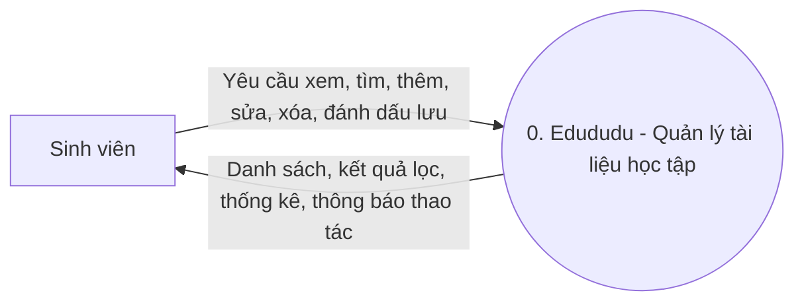
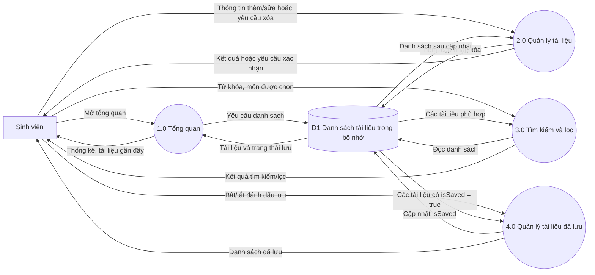

# Báo cáo giải trình áp dụng kiến trúc Cashew vào Edududu

## 1. Mục đích

Báo cáo trình bày cách tham khảo cấu trúc và luồng sử dụng của Cashew Expense Tracker để tổ chức ứng dụng quản lý tài liệu học tập Edududu. Phần áp dụng tập trung vào trải nghiệm dashboard, điều hướng theo khu vực chức năng, danh sách dữ liệu dùng chung và các thao tác quản lý tài liệu.

> Edududu tham khảo cách tổ chức sản phẩm và giao diện của Cashew; không sao chép mã nguồn hoặc khẳng định sử dụng nguyên trạng kiến trúc nội bộ của Cashew.

## 2. Nguyên tắc chuyển đổi

Cashew tập trung vào việc người dùng theo dõi tổng quan và thao tác với các bản ghi chi tiêu. Edududu chuyển cùng kiểu luồng đó sang nghiệp vụ học liệu:

| Mẫu trải nghiệm | Cách áp dụng trong Edududu |
|---|---|
| Dashboard tổng quan | Hiển thị số lượng tài liệu, số đã lưu, số môn và tài liệu gần đây. |
| Điều hướng giữa các khu vực | Thanh điều hướng dưới gồm Tổng quan, Thư viện, Đã lưu và Cá nhân. |
| Danh sách các bản ghi | Mỗi tài liệu được trình bày thống nhất bằng `DocumentTile`. |
| Tạo và cập nhật bản ghi | Form bottom sheet dùng chung cho thao tác thêm và sửa. |
| Bộ lọc và tra cứu | Thư viện tìm theo tên, môn học, loại tệp; đồng thời lọc theo môn. |
| Danh mục trực quan | Nhóm học liệu có màu riêng để nhận biết nhanh loại nội dung. |

Đơn vị dữ liệu chính của Edududu là tài liệu học tập thay cho giao dịch tài chính. Các thuật ngữ, thống kê và quy tắc được đổi theo nghiệp vụ giáo dục.

## 3. Kiến trúc hiện tại

Ứng dụng tổ chức theo hướng phân lớp nhẹ, phù hợp với prototype:

| Lớp | Thành phần | Trách nhiệm |
|---|---|---|
| Giao diện | `screens/`, `widgets/` | Hiển thị dashboard, thư viện, danh sách đã lưu, hồ sơ; nhận thao tác và phát callback. |
| Điều phối trạng thái | `AppShell` trong `lib/main.dart` | Giữ danh sách tài liệu, nhận kết quả từ form, thực hiện thêm/sửa/xóa/đánh dấu lưu và gọi `setState`. |
| Mô hình | `StudyDocument` trong `lib/models/` | Mô tả thuộc tính tài liệu và nhãn nhóm học liệu. |
| Dữ liệu khởi tạo | `lib/data/sample_documents.dart` | Cung cấp danh sách mẫu ban đầu. |
| Giao diện dùng chung | `lib/theme/app_theme.dart` | Tập trung `AppColors`, theme Material và màu danh mục. |

Các màn hình được giữ trong `IndexedStack`, còn `NavigationBar` đổi trang bằng chỉ số được quản lý tại `AppShell`. `HomeScreen`, `LibraryScreen` và `SavedScreen` nhận cùng danh sách tài liệu và callback; vì vậy các thao tác từ nhiều màn hình cùng tác động lên một nguồn trạng thái trong bộ nhớ.

### Luồng thao tác chính

1. Người dùng mở form thêm hoặc sửa.
2. Form trả về một `StudyDocument` khi xác nhận; đóng form không xác nhận thì không phát sinh thay đổi.
3. `AppShell` thêm tài liệu mới vào đầu danh sách hoặc thay phần tử đang sửa, sau đó gọi `setState` để dựng lại các màn hình.
4. Xóa tài liệu yêu cầu xác nhận trước khi `AppShell` loại phần tử khỏi danh sách.
5. Đánh dấu lưu cập nhật `isSaved`; màn Đã lưu lọc lại từ cùng danh sách.
6. Tìm kiếm và lọc môn học được thực hiện tại `LibraryScreen`, không ghi ngược dữ liệu vào danh sách gốc.

## 4. Yêu cầu chức năng

| Mã | Yêu cầu | Kết quả mong đợi |
|---|---|---|
| FR-01 | Xem tổng quan học liệu | Tính số tài liệu, số đã lưu, số môn và hiển thị tối đa ba tài liệu gần đây. |
| FR-02 | Xem thư viện | Hiển thị danh sách tài liệu và bộ lọc môn học. |
| FR-03 | Tìm kiếm | Lọc theo tên tài liệu, môn học hoặc loại tệp; không phân biệt chữ hoa/chữ thường. |
| FR-04 | Thêm tài liệu | Nhập tên, môn, nhóm học liệu và loại tệp; tên và môn không được để trống. |
| FR-05 | Sửa tài liệu | Hiển thị dữ liệu hiện tại, cho phép sửa và cập nhật bản ghi sau khi lưu. |
| FR-06 | Xóa tài liệu | Yêu cầu xác nhận trước khi xóa; hủy xác nhận thì giữ nguyên dữ liệu. |
| FR-07 | Đánh dấu đã lưu | Bật/tắt trạng thái lưu; màn Đã lưu phản ánh trạng thái đó. |
| FR-08 | Duyệt nhóm học liệu | Phân nhóm Bài giảng, Bài tập, Tham khảo, Đề thi và Mã nguồn; dùng màu để phân biệt. |
| FR-09 | Điều hướng | Cho phép chuyển giữa Tổng quan, Thư viện, Đã lưu và Cá nhân. |

Thông tin hồ sơ và các mục thiết lập hiện là giao diện minh họa; chưa có luồng cập nhật hồ sơ hay đồng bộ dữ liệu.

## 5. Sơ đồ luồng dữ liệu

### 5.1. Sơ đồ ngữ cảnh (DFD Level 0)

### 5.2. Sơ đồ phân rã chức năng (DFD Level 1)

`ProfileScreen` hiện chỉ hiển thị hồ sơ và các lựa chọn giao diện, chưa có nguồn dữ liệu hồ sơ riêng nên không được mô hình hóa thành tiến trình ghi/đọc dữ liệu trong DFD.

## 6. Đánh giá và giới hạn

Thiết kế hiện tại phù hợp để trình diễn luồng chính và phát triển giao diện nhanh. Việc gom trạng thái ở `AppShell` giúp các màn hình dùng chung một danh sách, tránh tạo bản sao dữ liệu theo từng tab.

Đây chưa phải kiến trúc production hoàn chỉnh:

- Danh sách được nạp từ `sampleDocuments` và chỉ lưu trong bộ nhớ; khởi động lại app có thể mất thay đổi.
- Chưa có repository, cơ sở dữ liệu cục bộ, API hay đồng bộ đa thiết bị.
- Tài liệu hiện là metadata; chưa có thao tác chọn, tải lên, mở hoặc tải xuống tệp thật.
- `StudyDocument` chưa có mã định danh ổn định; thao tác sửa hiện tìm phần tử trong danh sách đang giữ.
- `AppShell` vừa giữ trạng thái vừa thực hiện nghiệp vụ CRUD; khi nghiệp vụ tăng, lớp này có thể phình to.

## 7. Hướng phát triển đề xuất

1. Bổ sung ID ổn định cho tài liệu và tách `DocumentRepository` khỏi giao diện.
2. Chọn lưu trữ cục bộ (ví dụ SQLite/Isar) trước; sau đó bổ sung API nếu cần tài khoản và đồng bộ.
3. Tách nghiệp vụ thêm/sửa/xóa/tìm kiếm vào lớp điều phối trạng thái hoặc use case khi số màn hình và quy tắc tăng.
4. Tích hợp chọn tệp, lưu đường dẫn/metadata và xử lý quyền truy cập theo nền tảng.
5. Bổ sung kiểm thử cho xác thực dữ liệu, tìm kiếm rỗng, sửa nhóm học liệu và lỗi lưu trữ.

## 8. Kết luận

Edududu vận dụng mô hình trải nghiệm kiểu Cashew bằng dashboard tổng quan, điều hướng theo khu vực, danh sách thống nhất và thao tác CRUD nhanh. Phần kiến trúc code hiện được đơn giản hóa thành các lớp UI, model, dữ liệu mẫu, theme và một điểm điều phối trạng thái tại `AppShell`. Đây là nền tảng phù hợp cho prototype; bước tiếp theo để tiến gần kiến trúc ứng dụng hoàn chỉnh là bổ sung repository và lưu trữ bền vững.